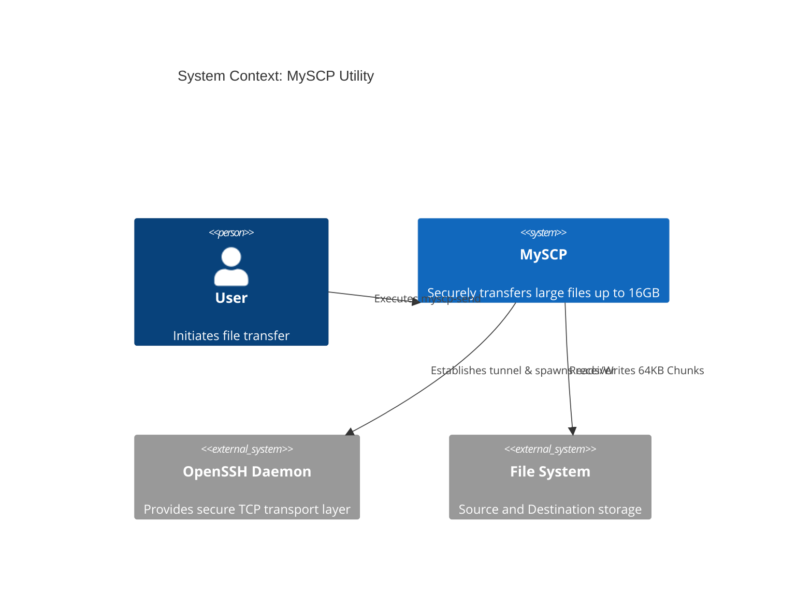

# Project Description: MySCP Secure File Transfer

## 1. Architecture Overview
MySCP is a high-performance, cross-platform file transfer utility built in C++ that operates over a TCP-based SSH tunnel. It utilizes a Client-Server architecture invoked dynamically; the sender authenticates via Public Key, dynamically locates the receiver binary on the remote host, and streams data over a secure channel using a custom binary protocol.

### C4 Architecture Diagram

## 2. Design Considerations

### Should I break the file into smaller chunks?
**Yes.** The utility reads and transmits data in `64 KB (65536 bytes)` chunks. This ensures that the memory footprint remains constant and incredibly small, allowing the application to securely transfer massive files (e.g., 16 GB+) without triggering Out-Of-Memory (OOM) killer processes on constrained systems. 

### Should I compress the file before transferring?
**No, but with a caveat.** Pre-compressing large files (like 16GB) requires massive upfront CPU cycles and temporary disk storage (Double I/O). Instead, MySCP delegates compression to the SSH transport layer (if configured via `~/.ssh/config`), allowing for real-time stream compression without altering the raw file bytes on disk.

### Error Handling and Retries
The system relies on strict boundary checks and POSIX error handling. 
- **Pre-flight Checks:** Verifies local file existence (`stat`) and remote binary availability before opening the data stream.
- **Network Interruptions:** The TCP/SSH layer handles packet loss. If the stream breaks fatally, the C++ `fread`/`fwrite` loops catch the broken pipe, terminate the transfer, and alert the user cleanly without segmentation faults.

### Economy of System Resource Utilization
The core philosophy of this tool is **Single-Pass Streaming**. 
Instead of hashing a 16GB file, transferring it, and hashing it again, MySCP calculates the SHA-256 hash *on the fly* as the 64KB chunks stream through the memory buffer. The final hash is appended to the stream as a `FileTrailer`. This strictly eliminates "Double I/O", cutting disk read operations by exactly 50%.
